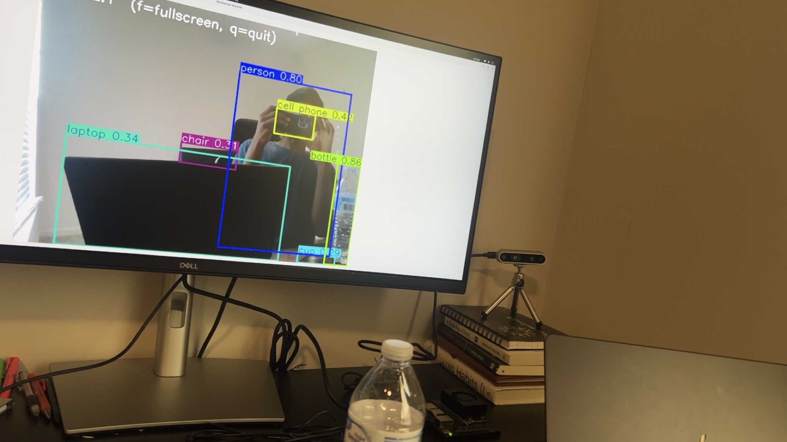
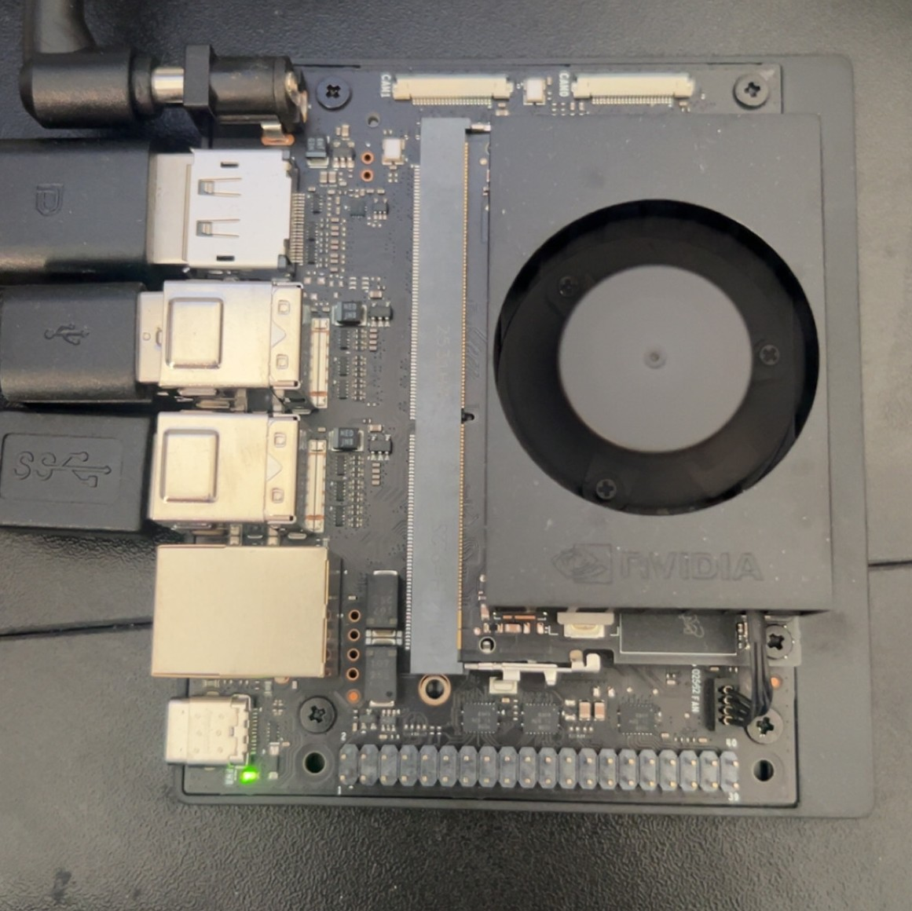
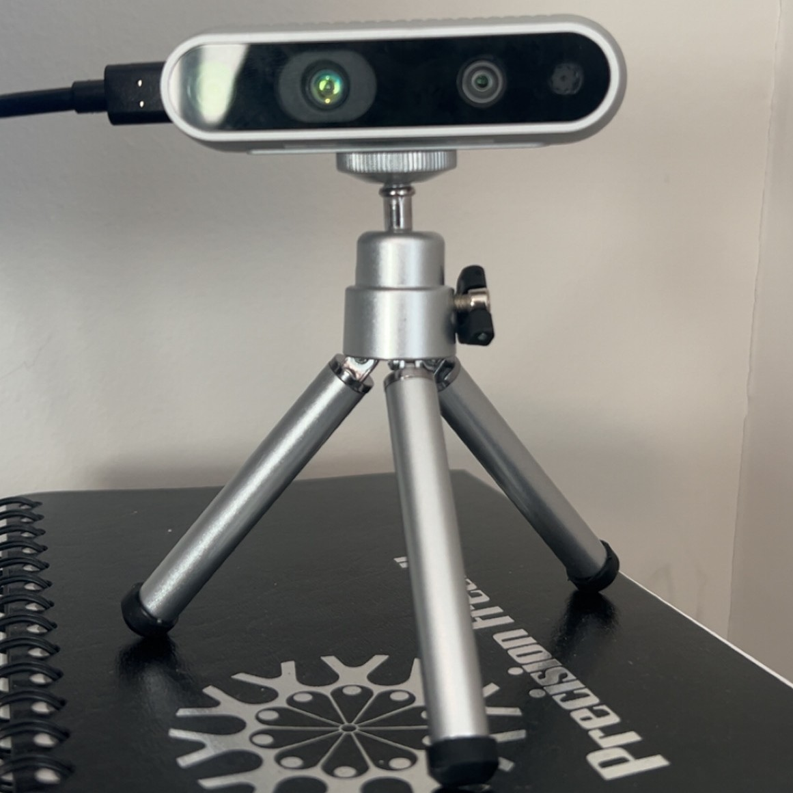

# Jetson Orin Nano + Intel RealSense + YOLOv8

A very basic real-time object detection project running directly on the NVIDIA Jetson Orin Nano using an Intel RealSense camera and YOLOv8.

I worked on this project to test my NVIDIA Jetson Orin Nano and Intel RealSense camera as a first and foundational step in my computer vision and automation journey.

This repository documents my setup process, integration steps, and troubleshooting while combining:



- Jetson Orin Nano (JetPack Ubuntu)
- Intel RealSense depth camera
- YOLOv8 (Ultralytics)
- OpenCV display pipeline

---

## Hardware Used

- NVIDIA Jetson Orin Nano Developer Kit
- Intel RealSense D435i
- 64GB+ microSD card
- DC barrel jack power supply
- HDMI monitor + keyboard + mouse

---

# 1️⃣ Jetson Orin Nano Setup



## Initial Flashing

During initial setup, I accidentally flashed the wrong JetPack image (meant for a different Jetson board). This required:

- Reformatting the SD card using SD Card Formatter
- Downloading the correct Jetson Orin Nano SD image
- Flashing using Balena Etcher
- Re-inserting SD card and completing Ubuntu first-boot setup

After successful boot:

```bash
sudo apt update
sudo apt upgrade -y
```

Installed essentials:

```bash
sudo apt install python3-pip git cmake
```

---

# 2️⃣ Intel RealSense Setup (ARM-Based Device)



RealSense is not fully plug-and-play on Jetson (ARM architecture).  
To ensure compatibility, I built librealsense from source.

## Install dependencies

```bash
sudo apt install git libssl-dev libusb-1.0-0-dev pkg-config \
libgtk-3-dev libglfw3-dev libgl1-mesa-dev libglu1-mesa-dev
```

## Clone and build librealsense

```bash
git clone https://github.com/IntelRealSense/librealsense.git
cd librealsense
mkdir build && cd build
cmake .. -DBUILD_PYTHON_BINDINGS=true
make -j4
sudo make install
```

## Verify installation

```bash
realsense-viewer
```

If the viewer launches and displays the camera feed, the installation is successful.

---

# 3️⃣ Python Environment Setup

Installed required Python libraries:

```bash
pip install ultralytics opencv-python pyrealsense2 numpy
```

Note: On ARM devices, some Python wheels are not always precompiled.  
Building librealsense from source ensures the Python bindings work properly.

---

# 4️⃣ Running Real-Time Object Detection


```bash
python3 run_yolo_realsense.py
```

Press `q` to exit.

The script:
- Streams color frames from the RealSense camera
- Runs YOLOv8 inference on each frame
- Displays annotated detections using OpenCV

---

# Issues Encountered & Fixes

## 1. Incorrect JetPack Image
Flashed wrong board image initially.
Fix:
- Reformatted SD card
- Re-flashed correct Orin Nano SD image

---

## 2. RealSense on ARM Architecture
RealSense SDK not fully plug-and-play on Jetson.
Fix:
- Built librealsense from source with Python bindings enabled

---

## 3. OpenCV Window Took Over Screen
Initially the detection window expanded fullscreen and prevented normal control.

Fix added to script:

```python
cv2.namedWindow("Detection", cv2.WINDOW_NORMAL)
cv2.resizeWindow("Detection", 800, 600)
```

---

# What This Project Demonstrates

This is intentionally a simple project, focused on validating hardware, understanding the Jetson Nano environment, and creating a real-time object detection